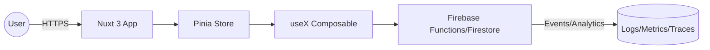

# Architecture Diagram: {{System/Feature Name}}

## Instructions
- Use C4-inspired levels: Context → Container → Component.
- Highlight trust boundaries (authN/authZ), data flow, and external dependencies.
- Show how Vue 3/Nuxt 3 clients interact with Pinia stores, composables, and Firebase services.
- Include observability (logs/metrics/traces) and feature flags.

## Context (C4 Level 1)
- **Users/Actors:** {{Personas}}
- **Systems:** {{Nuxt app, Firebase services, external APIs}}

## Container View (C4 Level 2)
- **Web Client (Nuxt 3)**
  - Pages/Layouts
  - Pinia Stores
  - Composables
- **Backend/Services**
  - Firebase (Auth, Firestore, Functions, Storage)
  - External APIs
- **Data Stores**
  - Firestore collections/documents
  - Caches (if any)

## Component View (C4 Level 3)
- **UI Components:** {{Key Vue components}}
- **State Management:** {{Pinia stores}}
- **Data Access Layer:** {{Firebase API wrapper, REST client}}
- **Utilities:** {{Validation, formatting}}
- **Observability:** {{Logging/metrics}}

## Example Mermaid (edit inline)

## Notes
- {{Performance budgets, caching strategy, offline approach}}
- {{Security/privacy considerations}}
- {{Open questions}}
